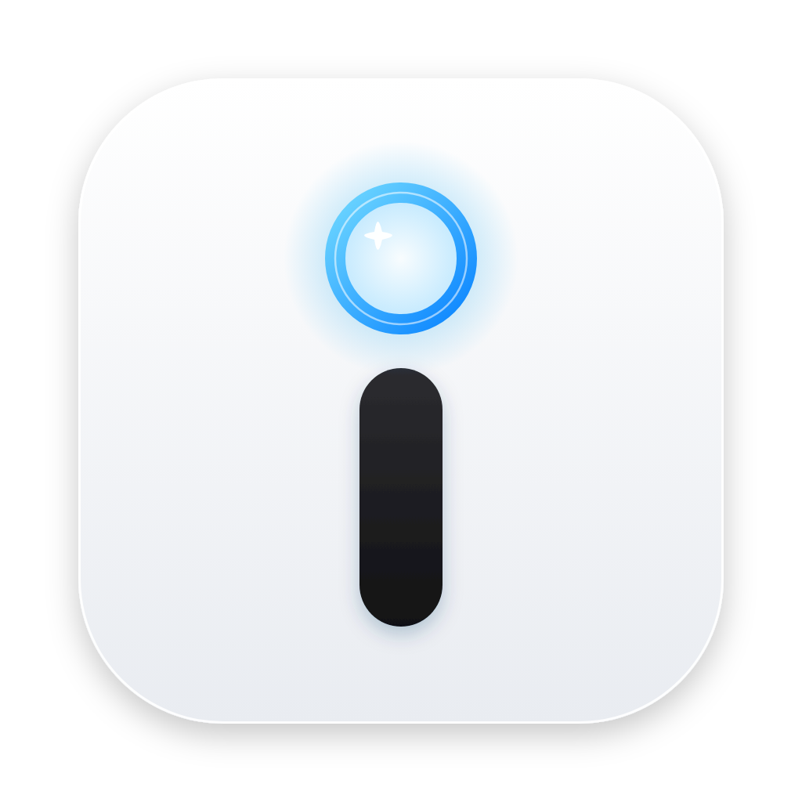

<div align="center">



# Glint · 瞳问

> 原名 LookAsk（看哪问哪）。**所见，即所问。**

**眼睛负责「大概在看哪」，Joy-Con 负责「就是这个词」，右边的 AI 自动知道你在看什么。**

[](#安装)
[](https://www.npmjs.com/package/electron)
[](https://www.npmjs.com/package/@mediapipe/tasks-vision)
[](native/LookAskBridge)
[](#iphone-原深感眼动)
[](#模型与-jev)
[](#joy-con-按键左手管左边右手管右边)
[](#jev-模式先判断再开口)

</div>

参考 Fovea「attention is now an input for AI」的思路，做成一个 Mac 桌面程序：左边放你要读的东西（论文 PDF、Markdown、跑着 Qwen Code 的终端），右边是可以自选大模型的对话 Agent。摄像头看你的眼睛，Joy-Con 精确点选，提问时自动把「你正在看的那段」当上下文发过去。参加天猫 AI 黑客松·高校挑战赛「效率进化」赛道。

## 能做什么

- **眼动追踪**：普通摄像头 + MediaPipe 人脸 478 点 + 双眼小图特征，17 点校准后岭回归映射到屏幕；One Euro 平滑、注视检测、眨眼帧丢弃
- **iPhone 原深感眼动**（第二种输入源）：iPhone 上的 Glint Eye（`ios/LookAskEye`）用 ARKit 拿头的三维位姿和双眼朝向，UDP 发给 Mac；Mac 把视线当成三维射线和屏幕平面求交，头挪、歪、前后动视线点都不跟着跑。设置 → 眼动 → 输入源 一键切换，两种源的校准分开存
- **越用越准**：用摇杆把焦点挪到目标再按 A，那一刻就是一次隐式校准；用手腕精调修正的那一下也会记成一次校准；读着读着视线点飘了，`⌥ + 点击` 正在看的地方，视线点当场拉回来
- **焦点系统**：视线落到哪段就淡淡圈出哪段（软焦点）；一推右摇杆变成逐词 / 逐行移动的硬焦点；R 键在「词 → 句 → 段 → 节」之间切
- **手腕精调**：按下右摇杆焦点跳到视线处，按住不放拧手腕，焦点就从那儿跟着手走（左右转逐词、上下点逐行），松开落定——眼睛负责跳到附近，手腕负责最后那一点，比摇杆一格一格推快
- **手柄震动当反馈**：眼睛本身就是输入，弹窗会把视线拉走，所以提示尽量走手感：焦点每挪一个词「咔」一下、跨句「咔咔」、跨段「咚」、到头「撞墙」；AI 开始出字往上扬一下、语音发出去往下沉一下、终端里的 Qwen Code 等你批准左手「心跳」、有风险三连震；右手柄 HOME 键的灯在 AI 思考时呼吸；手柄放在桌上时自动不震（硬桌面一震嗡嗡响），拿起来就恢复
- **左蓝右红**：界面配色跟两只 Joy-Con 对上——左边（内容）是左手柄的电光蓝，右边（AI 回答）整块是右手柄的电光红：字、图标、按钮、链接、提问气泡、解释窗口、焦点高亮都是红的。顶栏「内容 −」蓝、「回答 +」红；顶栏底下那道线只显示视线跟着的那一侧（左蓝 / 右红）；视线光环在左边是蓝、在右边是红。AI 在思考（提问到出第一个字之间）时，右侧顶线和「思考中…」变成 Joy-Con 电光紫，跟 HOME 灯一起呼吸
- **吸附**：视线圈会被附近的关键词（术语、缩写、公式、加粗……）吸过去包住；吸住时推右摇杆，硬焦点直接落在那个词上；软焦点也带迟滞，眼动抖出段外一点不会跳段。强度在「设置 → 眼动 → 吸附强度」里调（默认 70%，40% 左右是最早的手感）
- **视线分左右两边**：左手柄 − = 视线只跟左边内容，右手柄 + = 视线只跟右边的 AI 回答；看另一边时焦点原地不动，不会在两栏之间乱飘
- **往下裂变的解释窗口**：右侧模式下看着回答里不懂的地方按 A，解释不塞进主对话，而是在下面裂变出一个解释窗口；解释里还有不懂的，接着往下裂变一层，B 一层层收回
- **看图问**：截图键把视线跟着的那一侧整块截下来，在眼睛看的地方画一个蓝圈，交给看图模型「重点解释蓝圈里的东西」，不用先选准是哪一行
- **实时小人**：先拍一张大头照，阿里云百炼的千问图像模型（默认 `qwen-image-3.0-pro`）画成你的 Q 版卡通形象，默认待在右边回答区的右上角（可以拖走），跟着你的头实时挪动、歪头、转头；坐偏了、离远了它马上告诉你往哪挪（普通摄像头眼动对头的位置很敏感）
- **左侧三种内容**：PDF（版面分析：单双栏、章节标题、公式截图）、Markdown（公式回传 LaTeX 源码）、终端（node-pty，一键启动千问官方的编程智能体 Qwen Code，见下文）
- **扫描版 PDF 也能盯着问**：页面只是图片、没有文字层的论文（老论文扫描件、转曲的 PDF），自动按「文字的影子」切块——先摆正扫歪的页面，找出栏缝，再按行切段，图、表、公式各成一块（一页双栏论文通常切成十来块，不是死分几份）。视线照样按块选，推右摇杆逐行走，R 键在 行 → 段 → 栏 之间切；按 A / X / Y 或说话提问时，把盯着的那一块从 PDF 里高清截出来交给看图模型，翻译、解释、总结都能用。PDF 顶上会标「扫描件 · 按版面分块」
- **右侧对话 Agent**：OpenAI 兼容 / Anthropic 两类接口随便加；回答、翻译、看图三路模型分开配；回答可以「在左侧阅读」，再用眼睛追问
- **Jev 模式**：判断段落难度、判断你是不是卡住了再决定要不要主动插话、判断提问意图和要不要看图、判断终端里的 Qwen Code 是不是在等你批准
- **菜单栏小图标**：右上角一只小眼睛（睁眼 = 眼动在跑，闭眼 = 暂停），点开能看眼动 / 校准 / 手柄状态（放在桌上会标「放下」），一键暂停眼动、切摄像头 / iPhone、校准、测精度、切视线跟左边还是右边、开关 Jev、找手柄（两只一起「哔哔」响几秒、灯跟着闪）、打开文件、新建终端、进设置
- **语音**：按住 ZR 说话问 AI；终端里按住 ZL 说话，文字直接打进 Qwen Code（系统语音识别，Apple 芯片上本地完成）

## Joy-Con 按键：左手管左边，右手管右边

两只 Joy-Con 分开拿，一手一只。左手操作左侧内容，右手跟右侧 AI 对话。

| 左手 Joy-Con | 作用 |
| --- | --- |
| 左摇杆 | 上下滚动（推得越深越快），左右翻页 |
| 左摇杆按下 | 拍大头照（只在拍照窗口里用：装好后第一次打开先弹拍照窗口，按一下拍照，手柄重重震一下） |
| 十字键 ↑ ↓ | 文档：跳上 / 下一段；终端：方向键（在 Qwen Code 里选选项） |
| 十字键 → ← | 文档：翻页；终端：→ 回车确认，← Esc 打断 |
| L | 切换左侧标签页 |
| ZL（按住） | 终端：说话直接打字给 Qwen Code；文档：同 ZR |
| − | 视线跟左边内容（终端里再按 = ⇧Tab，切 Qwen Code 审批模式） |
| 截图键 | 视线跟着的那一侧整块截图，蓝圈标出你在看哪，交给看图模型重点解释 |

| 右手 Joy-Con | 作用 |
| --- | --- |
| 右摇杆 | 微调焦点：先落到视线圈吸住的词，再左右逐词、上下逐行，按住加速；每走一步手柄「咔」一下（跨句咔咔、跨段咚、到头撞墙） |
| 右摇杆按下 | 焦点跳回眼睛正在看的地方（视线圈吸着词就落在那个词上）；**按住不放拧手腕** = 从这里精调，左右转逐词、上下点逐行，松开落定 |
| A / X / Y | 解释 / 翻译 / 总结 |
| B | 放开焦点；AI 回答中 = 停止；右侧模式下 = 收起最下面一层解释窗口 |
| ZR（按住） | 说话提问，松开发送，自动带上焦点上下文 |
| R | 粒度：词 → 句 → 段 → 节（手柄咔 1~4 下，不用看屏幕就知道切到哪了） |
| + | 视线跟右边的 AI 回答（不懂的按 A 往下裂变解释）；长按 = 开关 Jev 模式 |
| HOME | 显示 / 隐藏 Glint（AI 思考、出字时这圈灯在呼吸） |

手柄的手感是一套固定的「词汇」（`src/renderer/src/input/haptics.ts`），同一类事件永远是同一种震法：

| 手感 | 意思 |
| --- | --- |
| 极短一下「咔」 | 焦点挪了一个词（按住摇杆连发时越走越轻） |
| 「咔咔」 / 低沉「咚」 / 重重「噔」 | 跨了一句 / 跨了一段 / 走到头了 |
| 咔 1~4 下 | 按 R 切到了 词 / 句 / 段 / 节 |
| 往上扬 | AI 等了一阵后开始出字（慢模型先想十几秒时，不用一直盯着右边） |
| 往下沉 | 松开 ZR / ZL，语音发出去了 |
| 左手「心跳」 | Qwen Code 在等你批准 / 在问你；没处理每 10 秒再跳一次，最多 3 次 |
| 左手三连 | Jev 判断这步放行有风险，要再按一次 → |
| 两只一起「长-短」 | 眼动断了（iPhone 断开 / 摄像头出错），或按右摇杆时看不到你的脸 |

手柄平放在桌上不动 3 秒就算「放下」：这时不震（找手柄除外），顶栏的手柄标记变淡，两只都放下时视线光环也淡下去；一拿起、一按键就恢复。

这样分的理由：高频动作（问、选、停）全在右手拇指和右扳机上；左手只管「内容怎么动」，所以在终端里十字键自然变成方向键和回车，用 Qwen Code 时可以靠在椅子上批准操作。− / + 正好一左一右：按哪边的键，视线就只跟哪一边。系统自带的 GameController 框架会把单只 Joy-Con 当成横握小手柄（没有 R / ZR / 摇杆按下），所以这里用原生助手直接读 HID 原始报告，每个键都能用，后台也能收到。

没连手柄也能用键盘：`⌥ + 方向键` 移焦点，`⌥⇧ + 方向键` 滚动，`⌥↩` 解释，`⌥T` 翻译，`⌥S` 总结，`⌥G` 切粒度，按住 `⌥空格` 说话，`⌥C` 看图问，`⌥D` 视线跟左边，`⌥J` 视线跟右边（按住 = Jev 模式）；顶栏的「内容 − / 回答 +」也能切。没校准眼动时鼠标停住就当视线，`⌥ + 点击` 直接落硬焦点（点到另一边会顺手切过去）；已校准时这一下同时是一次漂移校正。

## 实时小人

普通摄像头眼动对头的位置很敏感：离远了、挪开了、歪着头，校准出来的映射就整体偏了。现在有两层兜底：一是**头动补偿**（校准时记下你的三维坐姿，之后头挪一挪、转一转，按几何把视线点算回来，不用死板地坐回原位；设置 → 眼动 里可关，要重新校准一次才生效），二是右边回答区右上角常驻的「小镜子」：

1. 装好后第一次打开，先弹出拍照窗口：按一下左摇杆（或点「拍照」），倒数 3 秒拍一张大头照，拍下时手柄重重震一下；以后想重拍，点小人旁边的「⋯」菜单或 设置 → 眼动 → 实时小人
2. 照片交给阿里云百炼的千问图像编辑模型（默认 `qwen-image-3.0-pro`，走百炼原生的多模态生成接口，复用设置里千问的 Key），约半分钟画成 Q 版卡通形象，存在本机；照片本身不落盘
3. 之后小人跟着你的头实时动：它是一张会变形的 2.5D 网格（像 Live2D），转头是真的转过去（近的一侧放大、远的一侧压扁、鼻子挡住后面），还会跟着你眨眼、张嘴、挑眉、眼珠乱瞟，头发慢半拍甩一下，身体跟着呼吸起伏；左右上下挪、离近离远变大变小；虚线圈是校准时头的位置
4. 一偏就告诉你往哪挪（往左挪一点 / 往后靠一点 / 头摆正一点……），偏了超过 1.2 秒震一下手柄，给出「就在这儿重新校准」

小人可以拖到任何地方（会记住位置），菜单里能重拍或先藏起来。

## iPhone 原深感眼动

普通摄像头看到的是平面画面，头一挪、一歪，校准出来的映射就整体偏。iPhone 的原深感（TrueDepth）能直接给出头在三维空间里的位置和朝向、两只眼睛各自的朝向，于是 Mac 这边不再「背」一个映射，而是按几何算：从两眼中点沿视线方向打一条射线，和屏幕平面求交，再换成屏幕坐标。

**能解决什么（别期待太多）**：头挪动、歪头、前后移、转头都不会让视线整体偏；暗光下比摄像头稳。绝对精度只小幅提升，最后精确到词仍然靠吸附和摇杆。

**用法**：

1. iPhone 装上 Glint Eye（`ios/LookAskEye`，见下面「开发」），打开，屏幕会常亮
2. 手机竖放、前置镜头对着脸、离脸 40～70 厘米：
   - 测试时：立在 MacBook 屏幕和键盘之间的缝里（手机会挡住屏幕中下部，校准时被挡住的点自动跳过）
   - 以后：用背板挂在屏幕后面，镜头露出屏幕上沿
3. Mac 上 Glint：设置 → 眼动 → 输入源选「iPhone 原深感」，摆放位置选对应的一项
4. 手机上会列出附近的 Mac，点这台（只有一台时自动连）；第一次连要把手机上显示的 4 位配对码填进 Mac 的设置里，之后自动认得
5. 右上角「校准」，然后「测精度」；再歪头、往后靠、往旁边挪，看视线偏不偏

连接：同一 Wi‑Fi 局域网最常用；没有 Wi‑Fi 时 Mac 连 iPhone 的个人热点，其它不变；两边都开着 Wi‑Fi 时还能走点对点 Wi‑Fi（不用路由器）。数据走 UDP，每帧自带序号，乱序的旧帧直接丢；3 秒收不到帧顶栏显示「iPhone 已断开」，恢复后自动续上。手机发热时自动从 60 帧降到 30 帧。

对照组（不用新软件）：iPhone 当「连续互通相机」、设置里摄像头选 iPhone（先在控制中心 → 视频效果里关掉「人物居中」），重新校准、测精度——这测的是「更好的摄像头」，不是原深感。

配对码的作用是防止局域网里别人的手机误连、随手往你的 Glint 发假视线；它挡不住有心人抓包后暴力试码（数据本来就是明文 UDP）。

## 终端里的编程智能体：Qwen Code

左侧「终端」标签的「启动 Qwen Code」按钮跑的是 [Qwen Code](https://github.com/QwenLM/qwen-code)（千问官方开源的命令行编程智能体，命令 `qwen`），和 Qwen Code 一样在终端里读代码、改文件、跑命令，模型走阿里云百炼：

- **不用另配 Key**：Glint 起终端时把设置里「千问 · 阿里云百炼」的 Key 放进环境变量 `DASHSCOPE_API_KEY`，再用 `QWEN_CODE_SYSTEM_DEFAULTS_PATH` 指向 Glint 自己写的一份 Qwen Code 默认设置（`~/Library/Application Support/LookAsk/qwen-code/system-defaults.json`，不含 Key）。这一层优先级最低，你自己在 `~/.qwen/settings.json` 里配了 Coding Plan / Token Plan 或换了默认模型，都以你的为准
- **默认模型** `qwen3.8-max`（千问目前最强的编程 / 智能体模型，百炼北京价输入 12 元、输出 36 元 / 百万 token，命中缓存的输入 1.5 元）；进去后 `/model` 可换 `qwen3.7-plus`（输入 2 元、输出 8 元）或 `qwen3.8-flash`（输入 1 元、输出 3 元）
- **没装会自动装**：点按钮时如果 shell 报找不到 `qwen`，就地执行 `npm i -g @qwen-code/qwen-code@latest` 再启动（要 Node 22+）
- **审批模式**：Qwen Code 默认「自动模式」（先让模型判断每一步，安全的自动放行，有风险的拦下，反复被拦就转成人工确认）；终端里按 −（⇧Tab）轮换 计划 / 请求授权 / 自动编辑 / 自动 / YOLO。弹出「允许执行：'rm'？」「是否应用此更改？」时左手柄「心跳」，十字键 → 放行（开着 Jev 会先评风险）
- 想换回 Qwen Code 直接在终端里敲 `agent`，确认框和心跳提醒两家都认

## Jev 模式：先判断，再开口

[Jev](https://docs.typesafe.ai/api) 只做判断（choice / score / noul，带概率），不写字，便宜。Glint 让它决定「什么时候插话、怎么答」，写字交给大模型：

1. **看段落**：盯住一段 1.5 秒，判断难度（0～3 档）、有没有术语、是定义 / 公式 / 实验结果还是代码
2. **卡住了吗**：停留时长和回看次数先在本地分档成文字（Jev 不擅长读数字），再问它「读者是不是卡住了、想不想要主动解释」，超过 0.65 才插话
3. **提问路由**：你说一句话，它判断你要解释、翻译、总结、推导还是挑刺，要不要看图，答多详细，据此改写提示词、决定是否截图
4. **盯着终端里的 Qwen Code**：终端输出停下来时判断它是不是在等你批准，是的话左手柄「心跳」提醒，没处理每 10 秒再跳一次（最多 3 次）

每次判断都摊在右侧 Jev 面板里，带概率和 token 数。相同内容命中本地缓存不重复花钱，按天记账，有每日上限（Key 不能充值）。

## 架构

```
摄像头 ─ MediaPipe 人脸 478 点 ─ RealEye 特征（关键点+表情系数+双眼小图）─ 岭回归 ──┐
iPhone 原深感 ─ ARKit ─ UDP ─ Swift 原生助手 ─ 主进程验签配对 ─ 三维视线射线求交 ──┴─ 漂移校正 ─ One Euro ─ 注视检测
                                                                                                  │
Joy-Con L/R ─ IOHIDManager 原始报告（Swift 原生助手）─ 按键路由 ─────────────────┐                ▼
                                                                                   ├──→ 焦点控制器（软 / 硬，词 句 段 节）
麦克风 ─ SFSpeechRecognizer（Swift）─ 按住说话 ─────────────────────────────────┘          │
                                                                                            ▼
              左侧视图：PDF.js 文字层版面分析（扫描件按像素切块）/ Markdown / xterm+node-pty 终端
                                                                                            │ 焦点上下文
                                                    Jev 判断（路由、插话时机）──────────────┤
                                                                                            ▼
                                           右侧对话 Agent（主进程 net.fetch 流式调用，百炼千问 / 本地千问）
```

- `src/main`：窗口（校准全屏）、大模型流式调用、Jev 客户端（缓存 / 记账）、终端（`pty.ts`；Qwen Code 的 Key 和默认设置在 `qwenCode.ts`）、原生助手管理、原深感收包（`truedepth.ts`：验签、配对、丢乱序帧）
- `src/renderer/src/gaze`：眼动引擎、校准界面、视线图层；`sources/` 是两种输入源（摄像头、原深感），`td/` 是原深感的几何换算和校准模型
- `src/renderer/src/focus`：焦点控制器和三种适配器（DOM 文字、终端、屏幕）
- `src/renderer/src/input`：Joy-Con 解码与按键路由、触感词汇表（`haptics.ts`）、手腕精调（`wrist.ts`）
- `native/LookAskBridge`：Swift 原生助手（Joy-Con HID：按键 / 摇杆 / 6 轴 IMU、按 15ms 节拍发震动和灯；语音；原深感 UDP 收包 + Bonjour 广播），stdin/stdout 走 JSON 行协议
- `ios/LookAskEye`：iPhone 端 App Glint Eye（SwiftUI + ARKit + Network.framework），工程由 XcodeGen 生成

## 安装

1. 打开 `Glint-0.1.0-arm64.dmg`，把 Glint 拖进「应用程序」
2. 没做公证，第一次双击会被拦：右键 → 打开；提示「已损坏」就在终端执行
   `xattr -cr /Applications/Glint.app`
3. 按提示给权限：摄像头（眼动）、麦克风和语音识别（按住说话）；用 iPhone 原深感时还要「本地网络」
4. 第一次打开会先弹拍照窗口：按一下左摇杆拍张大头照（手柄重重震一下），生成你的实时小人；还没填 Key 的话它会带你去填
5. 设置 → 模型服务 →「千问 · 阿里云百炼」填 Key（在[百炼控制台](https://bailian.console.aliyun.com/cn-beijing/model/settings/api-key)创建，卡片上也有「去官网拿 Key」）：回答、翻译、看图、画小人全走它，不用中转站；设置 → Jev 判断里填 Jev Key
6. 右上角「校准」，盯完 17 个点（约 30 秒）
7. 可选，本地小模型（不联网也能用、不花钱）：执行 `bash scripts/setup-local-model.sh`（装 Ollama 并开机自启、下载千问 3.5 4B 约 3.4GB），再到 设置 → 模型分配 里选「本地千问 · Ollama」

Joy-Con 先在「系统设置 → 蓝牙」里配对（按住侧边小圆键进入配对）。手柄闲置会休眠断开，按任意键唤醒；被 Glint 接管后玩家灯会亮成常亮。

## 开发

```bash
npm install            # 会顺带下载 Electron、拷 MediaPipe/pdf.js 资源、为 Electron 重编译 node-pty
npm run build:native   # 编译 Swift 原生助手 → native/bin/lookask-bridge
npm run dev            # 开发模式（带远程调试端口 9333）
npm run dist           # 出 release/<版本>/LookAsk-<版本>-arm64.dmg
npm run test:truedepth # 原深感 Mac 端全链路测试（假 iPhone + Playwright，窗口会全屏跑一次校准，别碰键鼠）
npm run fake-iphone    # 假 iPhone：按协议往 Mac 发帧（--drop 5% --jitter 20ms --mirror 等）

bash ios/LookAskEye/build.sh test     # iPhone 端：生成工程 + 模拟器上跑单元测试
bash ios/LookAskEye/build.sh ipa      # 无签名 ipa → release/ios/（用 Sideloadly / AltStore 拿 Apple ID 重签安装）
bash ios/LookAskEye/build.sh device   # 用本机个人团队证书签名并装到插着线（或同一 Wi‑Fi、已解锁）的 iPhone
```

iPhone 端注意：没越狱的 iPhone 装不了完全无签名的 App；免费个人团队签的版本 7 天后过期，到时再跑一次 `device`；第一次打开要在「设置 → 通用 → VPN 与设备管理」里信任开发者。模拟器没有原深感人脸追踪，只能看界面、测连接。

国内网络：`.npmrc` 已配 npmmirror 和 Electron 镜像；Node 自带的 fetch 不认 `HTTP_PROXY`，首次下载 MediaPipe 模型超时可以加 `NODE_USE_ENV_PROXY=1`。

原生助手可以单独跑来查手柄：`native/bin/lookask-bridge`，按手柄上的键会打印 JSON。

测试开关（环境变量）：`LOOKASK_FAKE_CAM=1` 用 Chromium 假摄像头，再加 `LOOKASK_FAKE_CAM_FILE=<y4m/mjpeg>` 用视频文件当摄像头；`LOOKASK_USER_DATA=<目录>` 换一套用户数据（设置、校准、小人都分开存），能和已装好的 Glint 同时开；`LOOKASK_NO_BRIDGE=1` 不拉原生助手，免得和正在用的 Glint 抢手柄；`LOOKASK_BRIDGE_NO_JOY=1` 拉原生助手但不接管 Joy-Con（测原深感时用，收包在原生助手里）；`LOOKASK_TD_PORT` / `LOOKASK_TD_NAME` 指定原深感的 UDP 端口和 Bonjour 名字。

## 精度说明

普通摄像头眼动大约 2～4 度，笔记本 50 厘米外约 100～200 点，也就是「段落级」。所以设计上眼睛只负责粗定位，最后一步靠摇杆。M4 MacBook Air 的「人物居中」会自动裁切画面导致校准失效，用之前在控制中心 → 视频效果里关掉。

iPhone 原深感主要解决「头一动就偏」：用假 iPhone 数据（按 ARKit 常见的毛病加了眼睛转角偏小、偏置和噪声）测，校准后歪头 15° 视线偏约 25 点、左右挪 6 厘米约 7 点、往后靠 10 厘米约 18 点，同样数据不做三维几何的线性回归分别偏约 120、19、79 点。真机的绝对精度取决于 ARKit 的眼睛转角准不准，要在手机上实测。

## 第三方与许可

- 眼动特征与岭回归积木来自 [RealEye Webcam EyeTracker Light Open](https://github.com/RealEye-io/webcam-eyetracker-light-open)（AGPL-3.0 或其商业许可；估值 / 课题经费不超过 100 万美元的公司与学术项目可免费走商业许可）
- [MediaPipe](https://github.com/google-ai-edge/mediapipe)（Apache-2.0）、[pdf.js](https://github.com/mozilla/pdf.js)（Apache-2.0）、[xterm.js](https://github.com/xtermjs/xterm.js)（MIT）、[node-pty](https://github.com/microsoft/node-pty)（MIT）、[KaTeX](https://github.com/KaTeX/KaTeX)（MIT）
- Joy-Con HID 协议参考 [dekuNukem/Nintendo_Switch_Reverse_Engineering](https://github.com/dekuNukem/Nintendo_Switch_Reverse_Engineering)，HD 震动编码移植自 [tomayac/joy-con-webhid](https://github.com/tomayac/joy-con-webhid)
